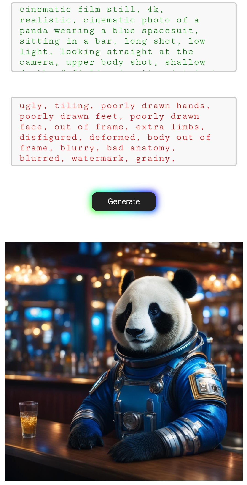
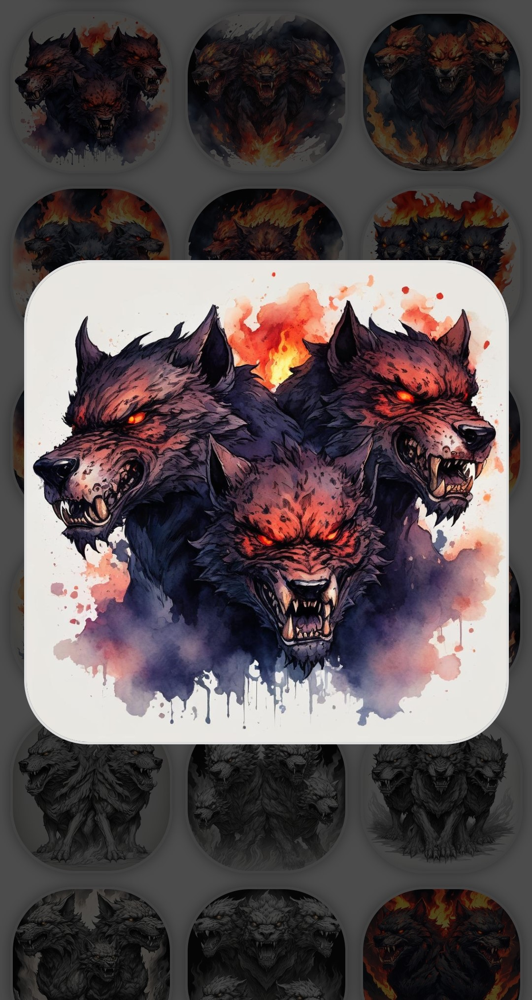

# Minimal SD Web UI

Serves as an interface for mobile devices to run SD models and review generations using a machine (with a suitable gpu) as a server on the local network.
Currently using the [Segmind SSD-1B model](https://huggingface.co/segmind/SSD-1B), but can be adapted to use any model.

Also provides functionality to copy selected generations onto a digital (Raspberry PI-powered) picture frame via the web UI.

## Previews from a mobile phone

#### Web UI

##### Provide positive and negative prompt to generate an image.

#### Gallery

##### Review last 200 generations.

##### Select a thumbnail for inspection.

